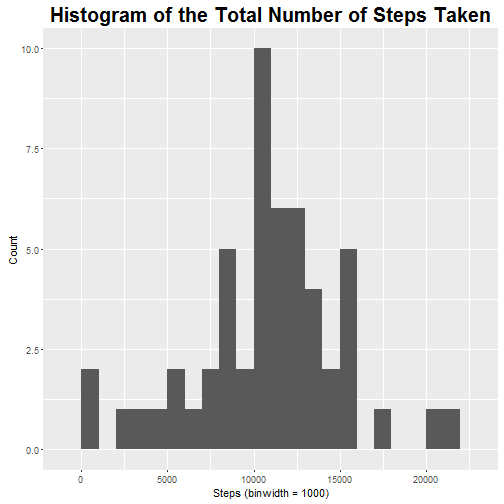
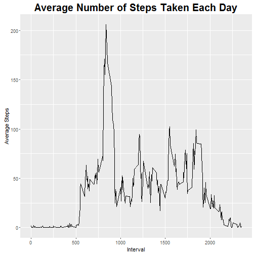
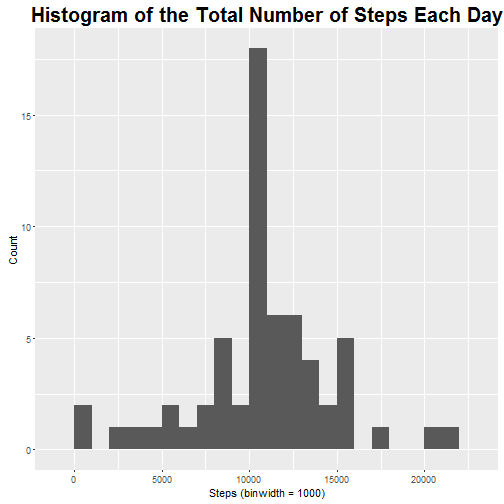
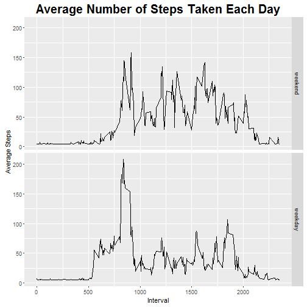

# Loading and preprocessing the data

The following code chunk:  
1. Clears the working environment  
2. Loads the necessary libraries  
3. Sets the working directory  
4. Loads the data

```r
rm(list=ls()) # Clear work environment
library(dplyr) # For data mumging
library(ggplot2) # For charting
setwd("U:/Data/Aja/Coursera/Reproducible Research/RepData_PeerAssessment1") # Set the WD
data <- read.csv("activity.csv") # load the data
```

# What is mean total number of steps taken per day?

Create a new data set with the NAs removed from the original data.

```r
data1 <- na.omit(data) # Remove NAs from data
```

Find the number of steps taken per day.

```r
steps <- data1 %>% 
      group_by(date) %>%
      summarise(totalsteps = sum(steps), meansteps = mean(steps),
                mediansteps = median(steps))
```

Histogram of the total number of steps taken each day.

```r
ggplot(steps, aes(totalsteps)) +
      geom_histogram(binwidth = 1000) +
      ggtitle("Histogram of the Total Number of Steps Taken") +
      theme(plot.title = element_text(size=20, face="bold", vjust=2)) +
      xlab("Steps (binwidth = 1000)") +
      ylab("Count")
```

 

Calculating the mean and median number of steps taken per day

```r
meansteps <- mean(steps$totalsteps)
mediansteps <- median(steps$totalsteps)
```

The mean and median number of steps taken per day are 1.0766189 &times; 10<sup>4</sup>
and 10765, respectively.

# What is the average daily activity pattern?

Work out the average numebr of steps over the 5-minulte intervals

```r
interval <- data1 %>% 
      group_by(interval) %>%
      summarise(totalsteps = sum(steps), meansteps = mean(steps),
                mediansteps = median(steps))
```

Plot the times erise of the the average number of steps taken, averaged across all days.

```r
ggplot(interval, aes(interval, meansteps)) +
      geom_line() +
      ggtitle("Average Number of Steps Taken Each Day") +
      theme(plot.title = element_text(size=20, face="bold", vjust=2)) +
      xlab("Interval") +
      ylab("Average Steps")
```

 

Claculate the interval that has the maximum number of steps on average

```r
maxsteps <- interval[which.max(interval$meansteps),1]
```

The interval which has the maximim number of steps is interval 835

# Imputing missing values

Calculate the total number of missing values

```r
missing <- sum(is.na(data$steps))
```

There are a total 2304 missing values in the dataset.

Impute the missing data with the average number of steps

```r
data2 <- merge(data, interval) # merge interval and data
data2  <- data2 %>% arrange(date) # re-order data
data2$steps[which(is.na(data2$steps))] <- mean(data2$steps, na.rm = TRUE)
```

Check if the number of missing values is equal to 0

```r
sum(is.na(data2$steps))
```

```
## [1] 0
```

Find the number of steps taken per day for new imputed data set

```r
steps1 <- data2 %>% 
      group_by(date) %>%
      summarise(totalsteps = sum(steps), meansteps = mean(steps),
                mediansteps = median(steps))
```

Plot histogram for new imputed data set

```r
ggplot(steps1, aes(totalsteps)) +
      geom_histogram(binwidth = 1000) +
      ggtitle("Histogram of the Total Number of Steps Each Day") +
      theme(plot.title = element_text(size=20, face="bold", vjust=2)) +
      xlab("Steps (binwidth = 1000)") +
      ylab("Count")
```

 

Calculate the mean and median for new data

```r
meansteps1 <- mean(steps1$totalsteps)
mediansteps1 <- median(steps1$totalsteps)
```

The mean and median number of steps taken per day are 1.0766189 &times; 10<sup>4</sup>
and 1.0766189 &times; 10<sup>4</sup>, respectively.

There was only a miminal impact of to the mean and meadian values by imputing 
the data with the average number of steps.

# Are there differences in activity patterns between weekdays and weekends?

Create a new factor variable f

```r
data2$weekday <- weekdays(as.Date(data2$date, "%Y-%m-%d"))
wkdays <- c('Monday', 'Tuesday', 'Wednesday', 'Thursday', 'Friday') # create a vector of weekdays
data2$wkday <- factor((weekdays(as.Date(data2$date, "%Y-%m-%d")) %in% wkdays), 
                   levels=c(FALSE, TRUE), labels=c('weekend', 'weekday'))
```

Work out the average numebr of steps over the 5-minulte intervals by day of week

```r
interval1 <- data2 %>% 
      group_by(interval, wkday) %>%
      summarise(totalsteps = sum(steps), meansteps = mean(steps),
                mediansteps = median(steps))
```

Plot the data for weekend and weekday

```r
ggplot(interval1, aes(interval, meansteps)) +
      geom_line() +
      facet_grid(wkday ~ .) +
      ggtitle("Average Number of Steps Taken Each Day") +
      theme(plot.title = element_text(size=20, face="bold", vjust=2)) +
      xlab("Interval") +
      ylab("Average Steps")
```

 
